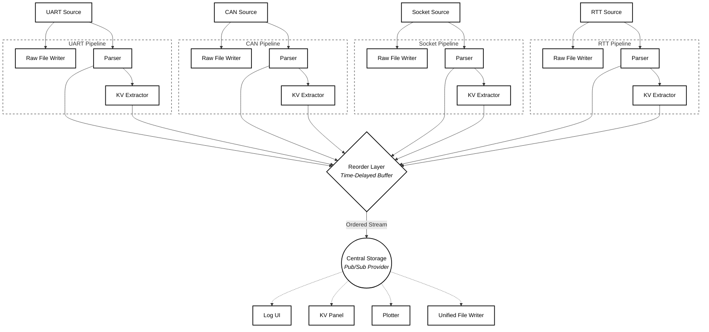

# BlinkView

**BlinkView** is a high-performance telemetry, log viewer, and visualization tool designed for embedded systems.

It provides real-time log streaming, structured parsing, key-value extraction, plotting, and multi-window monitoring — all optimized for high-throughput sources like UART, RTT, and sockets.

BlinkView helps you turn raw firmware logs into instant insight.

---

## Why BlinkView?

BlinkView is inspired by the first signal every embedded engineer knows: the blinking LED.

It focuses on:

- Fast insight
- Minimal friction
- Real-time visibility
- Embedded-friendly workflows

Launch your telemetry dashboard as easily as:

```bash
blink
```

---

## Features

- Real-time log viewing
- High-performance ingestion from multiple sources
- UART support
- CAN-bus + cantools + DBC integration for signal extraction
- Multi-window log views with independent filters
- Structured log parsing
- Configurable parsing templates
- Supports multiple device formats simultaneously
- Automatic module/submodule hierarchy
- Timestamp alignment using high-precision clocks
- Key-Value extraction panel
  - Extract numeric and state values from logs
  - Live updating values
- Detachable windows
- Multi-source telemetry
  - Multiple UART devices
  - Network sockets (basic support, needs work)
- Raw data logging and replay
  - Lossless raw logging
  - Timestamped binary format
- Modular multi-window UI
  - Independent log windows
  - Independent key-value panels
  - Fully configurable layout

---

## Performance

BlinkView is designed for high-throughput telemetry environments.

Features include:

- Lock-efficient central storage
- Multi-threaded ingestion pipeline
- Timestamp reorder buffering
- Minimal UI overhead
- Efficient append-only log storage
- Capable of handling millions of log lines per session

---

## Architecture Overview



Core logic is fully separated from the UI for performance and flexibility.

---

## Example Log Format

BlinkView supports flexible log formats such as:

```
[123.456] INFO main: System initialized
[123.789] WARN battery.current: 132 mA
[124.001] ERROR motor.driver: Overcurrent detected
```

Or custom formats via parser templates.

---

## Installation

### Requirements

- Python 3.10+
- PySide6 (for the UI)
- pyserial (for UART)
- optional: pyttsx3 (text-to-speech)

### UV package manager
UV is a modern Python tool for managing packages and tools.

We recommend installing BlinkView using UV for an easy and isolated setup.

https://docs.astral.sh/uv/getting-started/installation/

#### UV on Windows

```bash
powershell -ExecutionPolicy ByPass -c "irm https://astral.sh/uv/install.ps1 | iex"
```

### Install from source

```bash
# 1. Clone the repo
git clone git@github.com:roland2025/blinkview.git
cd blinkview

# install the tool to system
uv tool install ".[gui]" --python 3.13
```

#### Upgrading

```bash
uv tool upgrade blinkview
```

---

## Usage


```bash
# go to the project directory
cd your/project

# initialize the default profile
blink init

# start the GUI
blink
```

* if you initialized a project
  * profiles are saved in `./.blinkview/`
  * logs are saved in `./logs/`
* if you didnt init a project
  * profiles and logs are saved in `~/.blinkview/`

* recommended workflow:
  * initialize a profile for each project
  * start the GUI from the project directory
  * profiles can be added to git for team sharing
  * logs are in a separate directory and can be ignored in git

### Unified logs directory
By default, BlinkView saves logs in the current project directory under `./logs/`.

To centralize logs across projects, you can set a global log directory:

```bash
blink config --global log_dir /path/to/logs
```

---

## Supported Inputs

- UART
- CAN-bus (via cantools and DBC files)
- TCP / UDP sockets (basic support, needs work)
- Log files

---

## Design Goals

BlinkView is built with these priorities:

- Performance first
- Embedded-focused workflows
- Flexible parsing
- Multi-device support
- Non-blocking UI
- Extensibility

---

## Use Cases

BlinkView is ideal for:

- Firmware development
- Embedded debugging
- Telemetry visualization
- Robotics development
- Battery system monitoring
- Real-time system analysis

---

## Status

BlinkView is currently in active development.

Core features are functional, and the architecture is designed for long-term extensibility.

---

## Roadmap

- RTT, TCP/UDP source support
- file replay
- text-to-speech alerts
- live plotting
- advanced parsing templates
- 
---

## License

MIT License

---

## Name Origin

BlinkView is named after the first embedded program everyone writes:

```c
while (1)
{
    toggle_led();
}
```

The blink is the first signal that your system is alive.

BlinkView helps you see everything that follows.
