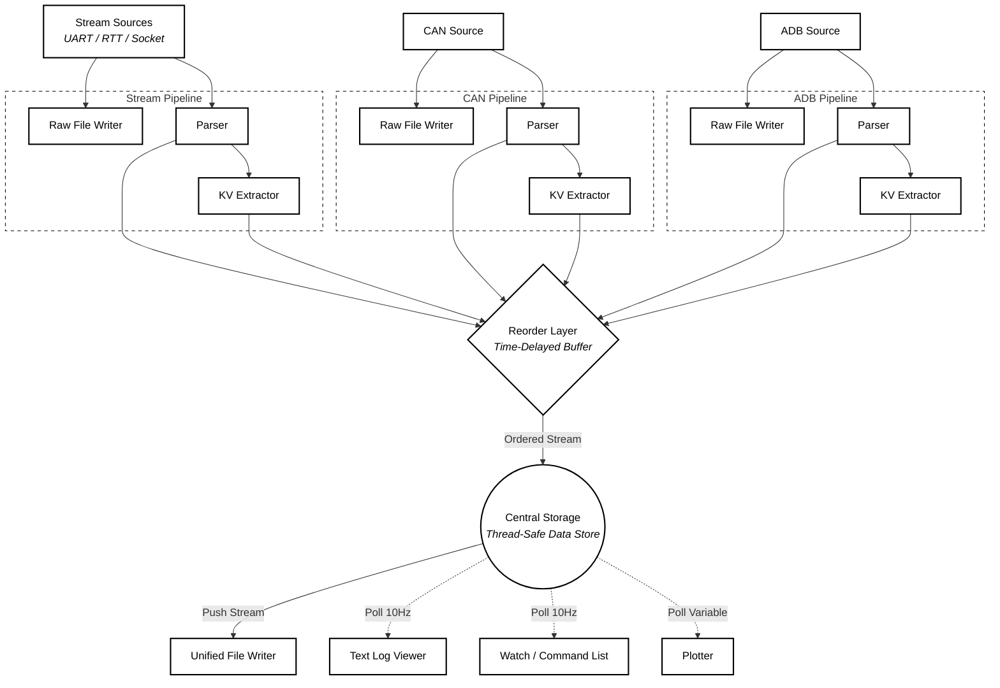

# BlinkView

**BlinkView** is a cross-device debugging tool for embedded systems. 

It aligns and analyzes logs from multiple sources—such as firmware (UART/RTT), CAN bus, and Android—in a single, time-synchronized timeline. Trace events across devices to understand real system behavior.

---

## The Problem: "Manual Glue"
In complex hardware/software systems, bugs rarely stay in one layer. Investigating a failure often means manually aligning timestamps from a serial terminal, a CAN log, and `adb logcat`.

BlinkView replaces ad-hoc 'log-merger' scripts with a **unified environment** that handles ingestion, time alignment, and visualization in one place.

BlinkView evolved from an internal tool used for debugging real multi-device embedded systems.

---
## Example Use Case

Debugging a command across a system:

- User presses a button in an Android app
- Command is sent over BLE or UART
- Controller processes it and sends CAN messages
- Motor or battery responds

BlinkView lets you see all of this in one timeline:
- Android logcat event
- Transport messages
- Firmware logs
- CAN signals (decoded via DBC)

This makes it possible to:
- trace behavior across components
- measure delays between steps
- identify where failures occur
---

## Installation

### Requirements

- Python 3.10+

BlinkView manages its dependencies via `uv`, including optional hardware backends and GUI support.

### Using UV (Recommended)
BlinkView is best installed via `uv` for environment isolation.

**Windows (PowerShell):**
```bash
powershell -ExecutionPolicy ByPass -c "irm https://astral.sh/uv/install.ps1 | iex"
```

**Install from source:**
```bash
# Clone the repo
git clone https://github.com/roland2025/blinkview.git
cd blinkview

# Install the tool
uv tool install ".[all]" --python 3.14
```

---

## Usage

```bash
# Go to your project directory
cd your/mcu/project

# Initialize the profile
blink init

# Launch the tool
blink
```

* **Profiles:** Stored in `./.blinkview/` (can be committed to Git).
* **Logs:** Saved in `./logs/` (should be ignored in Git).
* **Global Config:** Set a centralized log directory with `blink config --global log_dir /path/to/logs`.

---

## Features

* **Multi-Source Ingestion:**
  * Serial / UART
  * CAN-bus (with DBC decoding)
  * SEGGER RTT
  * TCP/UDP sockets
  * ADB logcat  *(experimental, filtering and integration still evolving)*.
* **Text Log Viewer:** 
  * Advanced filtering by device, module, and log level.
  * High-speed text search and highlighting.
  * Auto-pause on high-velocity bursts to maintain UI responsiveness.
* **Parsing & Extraction:**
  * Key-Value parser *(experimental/non-optimized)* for extracting structured data from raw text streams.
* **Session Persistence:** Automatically remembers window positions and active log filter settings. Pick up exactly where you left off without re-configuring your workspace.
* **Watch / Command List:** 
  * Monitor specific variables and latest state values.
  * Send structured commands back to the device.
* **Live Telemetry Plotting:** Real-time visualization of numeric data streams.
* **Unified Timeline Alignment:**
  * Best-effort time alignment across sources with different transport characteristics.
  * Leverages high-precision internal clocks where the hardware/transport allows (e.g., SEGGER RTT) and provides time-correlated views for higher-latency sources like UART or ADB.

---

## Architecture & Performance

BlinkView is designed for high-throughput telemetry. It utilizes a multi-threaded ingestion pipeline where data sources run in isolated threads to prevent cross-source blocking.

*   **Numba JIT Compilation:** Core parsing, filtering, and reordering logic is compiled to machine code for near-native performance.
*   **KV Extraction:** A dedicated extractor identifies key-value pairs within the stream for real-time monitoring.
*   **Time-Reordering:** A reorder layer buffers incoming packets to handle varying transport latencies and produce a cohesive chronological stream.



---

## Name Origin

BlinkView is named after the first embedded program everyone writes:

```c
while (1) {
    toggle_led();
}
```

The blink is the first signal that your system is alive. BlinkView helps you see everything that follows.

---

**License:** Mozilla Public License 2.0 (MPL-2.0)
