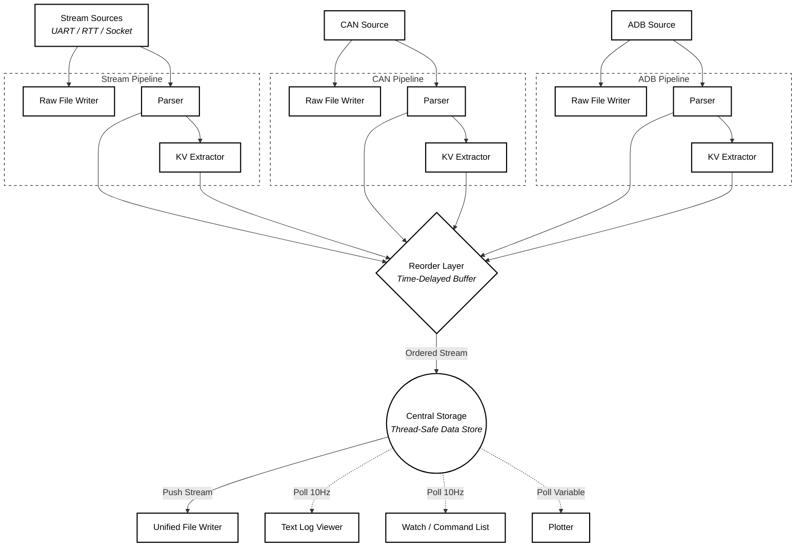

# BlinkView

[🖥️ GitHub Repository](https://github.com/roland2025/blinkview) | [🐛 Report a Bug](https://github.com/roland2025/blinkview/issues)

**BlinkView** is a high-performance log and telemetry viewer for multi-source, high-throughput systems—embedded devices, distributed services, or anything in between.

It aligns and analyzes logs from multiple sources—such as firmware (UART/RTT), CAN bus, Android, or plain TCP/UDP sockets—in a single, time-synchronized timeline. Trace events across processes and devices to understand real system behavior.

### LogViewer and filter with telemetry table

Log Viewer view with one source filtered out, with latest values per module visible in telemetry table.


### Main Ui and Watch window

Ingestion from 2 TCP sources, with a custom watch list example. Latest values from all parsed modules visible in telemetry table


### Split plot view with discrete mode enabled on one channel


---

## The Problem: "Manual Glue"
In complex hardware/software systems, bugs rarely stay in one layer. Investigating a failure often means manually aligning timestamps from a serial terminal, a CAN log, and `adb logcat`.

BlinkView replaces ad-hoc 'log-merger' scripts with a **unified environment** that handles ingestion, time alignment, and visualization in one place.

BlinkView started as an internal tool for debugging real multi-device embedded systems, and has since grown into a general-purpose tool for any high-throughput, multi-source logging problem—hardware or software.

---
## Example Use Case

Debugging a command across a system:

- User presses a button in an Android app
- Command is sent over BLE or UART
- Controller processes it and sends CAN messages
- Motor or battery responds

BlinkView lets you see all of this in one timeline:
- Android logcat event
- Transport messages
- Firmware logs
- CAN signals (decoded via DBC)

This makes it possible to:
- trace behavior across components
- measure delays between steps
- identify where failures occur

The same approach applies just as well without any hardware in the loop. Debugging a distributed client/server app:

- Client sends a request over a TCP socket
- Backend service logs the request, does some work, and responds
- Multiple backend workers log concurrently under load

BlinkView lets you see all of this in one timeline:
- Client-side log events
- Backend request/response logs, correlated across workers
- Structured `key=value` fields extracted from each log line for filtering

This makes it possible to:
- trace a single request across processes
- spot which worker or service introduced a delay
- correlate client-observed failures with backend-side causes
---

### 🚀 Live Integration Demo

Want to see BlinkView coordinate a live system right now? Explore this fully configured client-backend simulation package, ready to clone and run:

👉 **[BlinkView Python Client-Backend Demo Repository](https://github.com/roland2025/blinkview-python-demo)**

This demo includes a multi-threaded Qt Client and a headless Backend service—no embedded hardware involved, just plain TCP sockets. It lets you click buttons, adjust sliders, and generate synthetic log streams so you can watch BlinkView extract, plot, and align the network telemetry in real time.

---

## Installation

### Requirements

- Python 3.10+

BlinkView manages its dependencies via `uv`, including optional hardware backends and GUI support.

### Using UV (Recommended)
BlinkView is best installed via `uv` for environment isolation.

**Windows (PowerShell):**
```bash
powershell -ExecutionPolicy ByPass -c "irm https://astral.sh/uv/install.ps1 | iex"
```

**Install from source:**
```bash
# Clone the repo
git clone https://github.com/roland2025/blinkview.git
cd blinkview

# Install the tool
uv tool install ".[all]"
```

---

## Usage

```bash
# Go to your project directory
cd your/project

# Initialize the profile
blink init

# Launch the tool
blink
```

* **Profiles:** Stored in `./.blinkview/` (can be committed to Git).
* **Logs:** Saved in `./logs/` (should be ignored in Git).
* **Global Config:** Set a centralized log directory with `blink config --global log_dir /path/to/logs`.

---

## Features

* **Multi-Source Ingestion:** Supported source types include:
  * Serial / UART
  * CAN-bus (with DBC decoding)
  * SEGGER RTT
  * TCP/UDP sockets
  * ADB logcat—dedicated long-format decoder with timestamp, level, module, and PID/TID extraction built in as ready-to-use pipeline steps. PID→process-name resolution is history-aware, so a reused PID (Android recycles them) still resolves to whichever process actually owned it at that line's timestamp, not just whatever currently holds it.
  * Live file tailing—follows a growing text/log file (`tail -f`-style), with truncation/rotation detection, for desktop and console application logs.
  * Binary file replay—for offline analysis or replaying a previously captured session.
* **Generic Desktop/Console Log Parsing:** Timestamp formats beyond embedded-device conventions—ISO 8601-style (`YYYY-MM-DD HH:MM:SS[.,]fff`, e.g. Python `logging`/log4j output) and classic RFC3164 syslog (`Mon DD HH:MM:SS`)—so plain desktop/service logs parse without a custom pipeline.
* **Text Log Viewer:** 
  * Advanced filtering by device, module, and log level.
  * High-speed text search and highlighting.
  * Structured `key=value` (logfmt) filtering—combine free-text search with exact-match conditions like `status=ok user_id=42`, evaluated directly on parsed log rows via a Numba-JIT kernel.
  * Auto-pause on high-velocity bursts to maintain UI responsiveness.
* **Table-Based Log Viewer:** A structured, columnar alternative to the text viewer—Time, Device, Level, Module, and Message as resizable columns. Shares the same live-tail / bounded-history fetch model and `key=value` filtering as the text viewer.
* **Parsing & Extraction:**
  * Multi-rule Key-Value extractor—Numba-JIT backed, five composable rule types for pulling structured data out of raw text streams: `key=value` pairs, anchor-word patterns (startswith/endswith/contains), lightweight JSON key lookup, CSV-like delimiter-separated fields, and fixed word-position slices.
* **Playback & Scrubbing:** Treats live and recorded data as one continuous timeline, not two separate modes.
  * **LIVE / REPLAY:** Drop out of the live tail at any point to scrub history, then jump straight back to live.
  * **Session Replay:** Reopen any past recording from the **Load Session...** menu (or `blink replay` on the CLI) and scrub it exactly like a live one. The main timeline pins itself to that recording's actual length instead of the raw memory buffer, while a second, always-visible timeline keeps tracking the live edge independently—so replaying a fixed session never costs you your place in "now."
  * **Jog Wheel:** Press-and-drag precise scrubbing—the cursor hides and the drag speed (not distance) determines step size, from single-row stepping at a slow drag up to a fast shuttle.
  * **Named Ranges:** Mark start/end points and name them like clips in a video editor. Saved alongside the session's own captured data, so ranges are there again the next time that session is replayed.
  * **Force Live:** Pin an individual view (table, watch list, plot) to live data even while the shared clock is scrubbed into REPLAY elsewhere—useful for keeping one window on "now" while you dig through history in another.
* **Extended Scrollback:** Evicted segments are archived to a memory-mapped disk tier (ideally on NVMe) instead of being dropped—extending scrollback far past what fits in memory, transparently, with no change to filtering/search.
  * **Automatic Hot/Cold Sizing:** The in-memory ("hot") tier can grow to use most of whatever system RAM is actually free, and shrink automatically the moment free memory gets tight elsewhere on the machine—reacting to real system pressure instead of a static size picked once at startup, with a configurable floor so recent scrollback never becomes disk-latency-bound.
  * **Compressed at Rest:** Both the disk-tier ("cold") segments and the raw session/source log files are zstd-compressed once they're done being written, shrinking a recording's on-disk footprint with no change to how it's read back. A progress toast tracks the final compression pass on app close, so the app never exits mid-write.
* **Session Persistence:** Automatically remembers window positions and active log filter settings. Pick up exactly where you left off without re-configuring your workspace.
* **Watch / Command List:** 
  * Monitor specific variables and latest state values.
  * Send structured commands back to the device.
* **Live Telemetry Plotting:** Real-time visualization of numeric data streams.
  * **Discrete Mode:** Supports rendering boolean or integer state values by automatically synthesizing intermediate steps. This creates a clean, "staircased" layout that accurately represents step-wise state changes rather than continuous slopes.
* **Unified Timeline Alignment:**
  * Best-effort time alignment across sources with different transport characteristics.
  * Leverages high-precision internal clocks where the hardware/transport allows (e.g., SEGGER RTT) and provides time-correlated views for higher-latency sources like UART or ADB.

---

## Architecture & Performance

BlinkView is designed for high-throughput telemetry. It utilizes a multi-threaded ingestion pipeline where data sources run in isolated threads to prevent cross-source blocking.

*   **Numba JIT Compilation:** Core parsing, filtering, and reordering logic is compiled to machine code for near-native performance.
*   **KV Extraction:** A dedicated extractor identifies key-value pairs within the stream for real-time monitoring.
*   **Time-Reordering:** A reorder layer buffers incoming packets to handle varying transport latencies and produce a cohesive chronological stream.
*   **Pooled, Struct-of-Arrays Storage:** Log rows are held as pooled NumPy arrays (not per-message Python objects), with an optional memory-mapped disk tier for older segments—the same filter/search kernels run unmodified whether a segment is in RAM or on disk.


```mermaid
graph TD
    %% Source Nodes
    StreamSource[Stream Sources <br/> <i>UART / RTT / Socket</i>]
    CAN[CAN Source]
    ADB[ADB Source]

    %% Pipeline Subgraphs
    subgraph Stream_Pipe [Stream Pipeline]
        Stream_Raw[Raw File Writer]
        Stream_P[Parser]
        Stream_KV[KV Extractor]
    end

    subgraph CAN_Pipe [CAN Pipeline]
        CAN_Raw[Raw File Writer]
        CAN_P[Parser]
        CAN_KV[KV Extractor]
    end

    subgraph ADB_Pipe [ADB Pipeline]
        ADB_Raw[Raw File Writer]
        ADB_P[Parser]
        ADB_KV[KV Extractor]
    end

    %% Reorder Logic
    Reorder{Reorder Layer <br/> <i>Time-Delayed Buffer</i>}
    
    %% Central Hub
    Storage((Central Storage <br/> <i>Thread-Safe Data Store</i>))

    %% Flow: Sources to Reorder
    StreamSource --> Stream_Raw
    StreamSource --> Stream_P
    Stream_P --> Stream_KV
    Stream_P & Stream_KV --> Reorder

    CAN --> CAN_Raw
    CAN --> CAN_P
    CAN_P --> CAN_KV
    CAN_P & CAN_KV --> Reorder

    ADB --> ADB_Raw
    ADB --> ADB_P
    ADB_P --> ADB_KV
    ADB_P & ADB_KV --> Reorder

    %% Flow: Reorder to Storage
    Reorder -- Ordered Stream --> Storage

    %% Output Nodes (Consumers)
    UWriter[Unified File Writer]
    LogView[Text Log Viewer]
    WatchCmd[Watch / Command List]
    Plotter[Plotter]

    %% Data Flow: Storage to Consumers
    Storage -- Push Stream --> UWriter
    Storage -.->|Poll 10Hz| LogView
    Storage -.->|Poll 10Hz| WatchCmd
    Storage -.->|Poll Variable| Plotter

    %% B&W Styling
    classDef bw fill:#fff,stroke:#000,stroke-width:2px,color:#000
    class StreamSource,CAN,ADB,Stream_P,CAN_P,ADB_P,Stream_KV,CAN_KV,ADB_KV,Stream_Raw,CAN_Raw,ADB_Raw,Reorder,Storage,LogView,WatchCmd,Plotter,UWriter bw
    style Stream_Pipe fill:none,stroke:#000,stroke-dasharray: 5 5
    style CAN_Pipe fill:none,stroke:#000,stroke-dasharray: 5 5
    style ADB_Pipe fill:none,stroke:#000,stroke-dasharray: 5 5
```

---

## Name Origin

BlinkView is named after the first embedded program everyone writes:

```c
while (1) {
    toggle_led();
}
```

The blink is the first signal that your system is alive. BlinkView helps you see everything that follows.

---

**License:** Mozilla Public License 2.0 (MPL-2.0)
